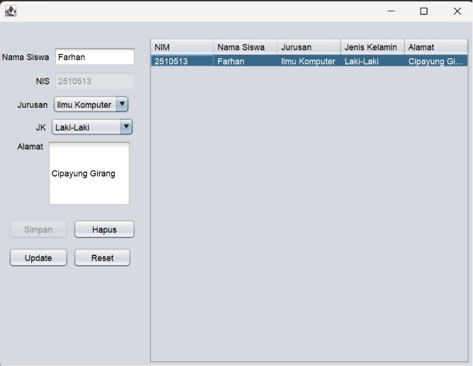

# 📚 GUI CRUD Kelola Mahasiswa

Aplikasi desktop berbasis Java Swing untuk mengelola data mahasiswa dengan operasi **Create, Read, Update, dan Delete (CRUD)**. Dibuat menggunakan NetBeans IDE dengan build tool Maven dan koneksi ke database MySQL.

---

## 👤 Identitas

| Keterangan | Detail |
|---|---|
| **Nama** | Farhan |
| **NIM** | I.2510513 |
| **Mata Kuliah** | Pemrograman Berorientasi Objek / Basis Data |
| **IDE** | NetBeans |
| **Bahasa** | Java |

---

## 🛠️ Teknologi yang Digunakan

- **Java** — Bahasa pemrograman utama
- **Java Swing** — Library GUI bawaan Java untuk membangun antarmuka desktop
- **JDBC (Java Database Connectivity)** — Koneksi antara Java dan database
- **MySQL** — Database untuk menyimpan data mahasiswa
- **Maven** — Build tool dan manajemen dependensi
- **NetBeans IDE** — Integrated Development Environment

---

## ✨ Fitur

- ➕ **Create** — Tambah data mahasiswa baru
- 📋 **Read** — Tampilkan seluruh data mahasiswa dalam tabel
- ✏️ **Update** — Ubah data mahasiswa yang sudah ada
- 🗑️ **Delete** — Hapus data mahasiswa

---

## 📁 Struktur Proyek

```
gui_crud_kelola_mahasiswa_farhan_I.2510513/
├── src/
│   └── main/
│       └── java/
│           └── (package utama aplikasi)
├── .idea/
├── pom.xml
└── .gitignore
```

---

## ⚙️ Cara Menjalankan

### Prasyarat

Pastikan sudah terinstal:
- Java JDK 8 atau lebih baru
- NetBeans IDE
- MySQL Server
- MySQL Connector/J (JDBC Driver)

### Langkah-langkah

**1. Clone Repository**
```bash
git clone https://github.com/HanKitsunee/gui_crud_kelola_mahasiswa_farhan_I.2510513.git
```

**2. Buat Database MySQL**

Buka MySQL dan jalankan perintah berikut:
```sql
CREATE DATABASE db_mahasiswa;
USE db_mahasiswa;

CREATE TABLE mahasiswa (
    nim        VARCHAR(20)  PRIMARY KEY,
    nama       VARCHAR(100) NOT NULL,
    jurusan    VARCHAR(100),
    angkatan   INT
);
```
> Sesuaikan nama tabel dan kolom jika berbeda dengan kode sumber.

**3. Konfigurasi Koneksi Database**

Cari file konfigurasi koneksi (biasanya `Koneksi.java` atau sejenisnya) dan sesuaikan:
```java
String url  = "jdbc:mysql://localhost:3306/db_mahasiswa";
String user = "root";
String pass = ""; // sesuaikan dengan password MySQL kamu
```

**4. Buka di NetBeans**

- Buka NetBeans → `File` → `Open Project`
- Pilih folder hasil clone
- NetBeans akan otomatis mendeteksi proyek Maven

**5. Jalankan Proyek**

Klik tombol **Run** (▶) atau tekan `F6`.

---

## 📸 Tampilan Aplikasi

> **

---

## 📝 Catatan

- Pastikan MySQL Server dalam keadaan aktif sebelum menjalankan aplikasi.
- Driver JDBC (`mysql-connector-java`) sudah terdaftar sebagai dependensi di `pom.xml` — Maven akan mengunduhnya otomatis.
- Jika muncul error koneksi, periksa kembali host, port, nama database, username, dan password pada file koneksi.

---

## 📄 Lisensi

Proyek ini dibuat untuk keperluan tugas akademik.
